要求三

mysql>insert into member(name,username,password)values("Alice","test","test");
mysql>insert into member(name,username,password,follower_count)values("Amy","amy","testamy",100);
mysql>insert into member(name,username,password,follower_count)values("Ines","ines","testines",666);
mysql>insert into member(name,username,password,follower_count)values("Peggy","peggy","testpeggy",888);
mysql>insert into member(name,username,password,follower_count)values("Annie","annie","testannie",168);

mysql>INSERT INTO member (id, name, username, password, follower_count, time)
-> VALUES (9, "Cynthia", "cynthia", "testcynthia", 678, '2023-07-31 22:59:59'),
-> (7, "Vivian", "vivian", "testvivian", 123, NOW()),
-> (6,"Katy","katy","testkaty",666,"2023-07-28 13:20:20"),
-> (8,"Daniel","daniel","testdaniel",789,now());

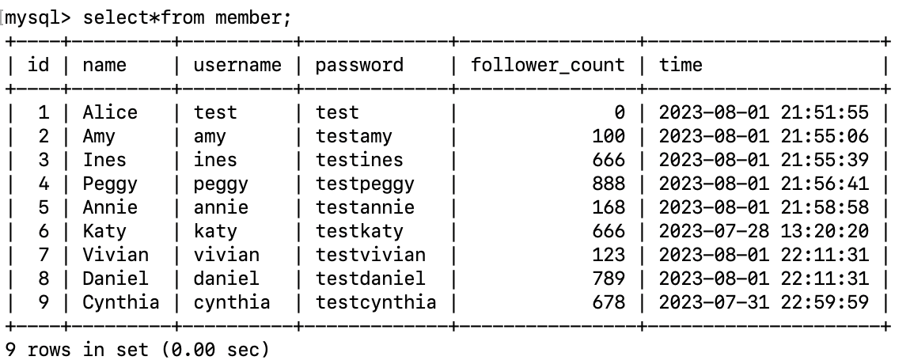

mysql>select*from member order by time desc;

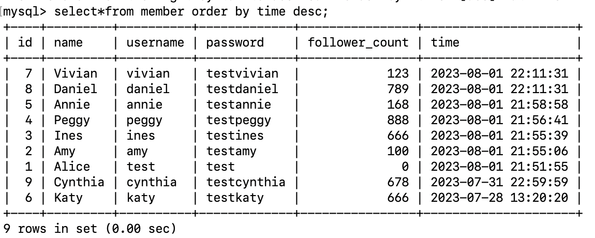

mysql>select*from member order by time desc limit 1,3;

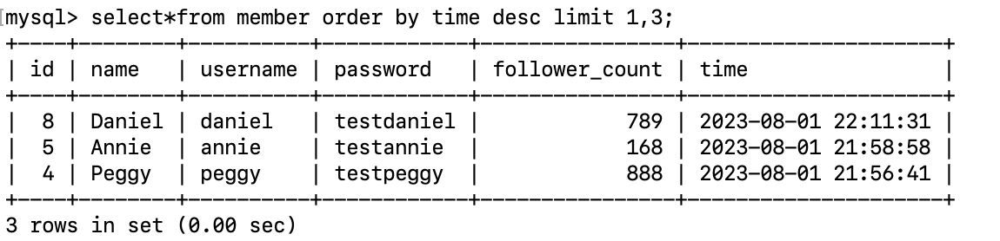

mysql>select*from member where username="test";

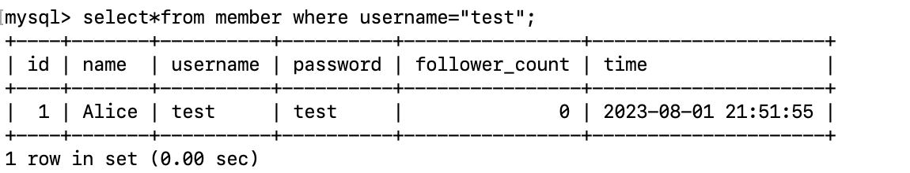

mysql>select*from member where username="test" and password="test";

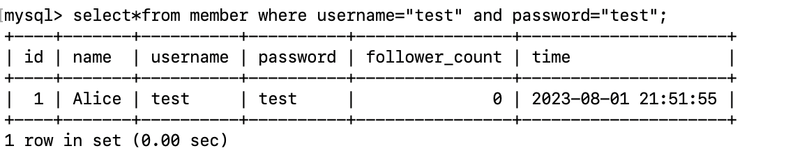

mysql>update member set username="test2" where id=1;

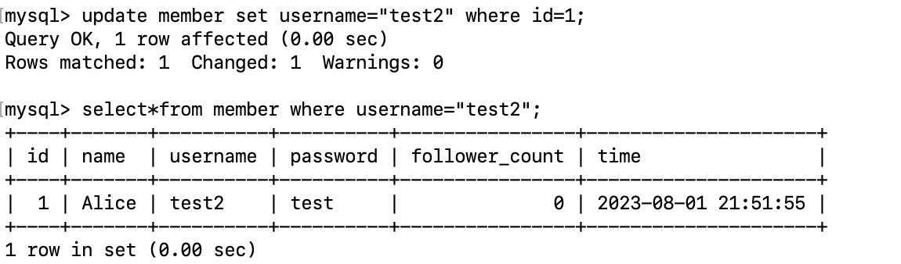

任務四

mysql>select count(id) from member;

mysql>select sum(follower_count) from member;

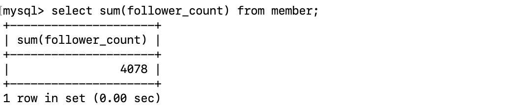

mysql>select avg(follower_count) from member;

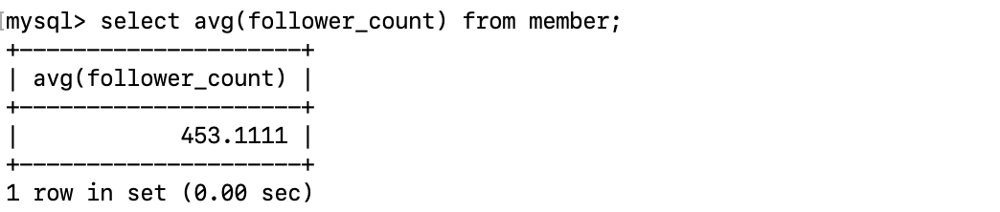

要求五

mysql> create table message(
-> id bigint primary key auto_increment,
-> member_id bigint not null,
-> content varchar(255) not null,
-> like_count int unsigned not null default 0,
-> time datetime not null default current_timestamp);

mysql> alter table message add foreign key(member_id) references member(id);

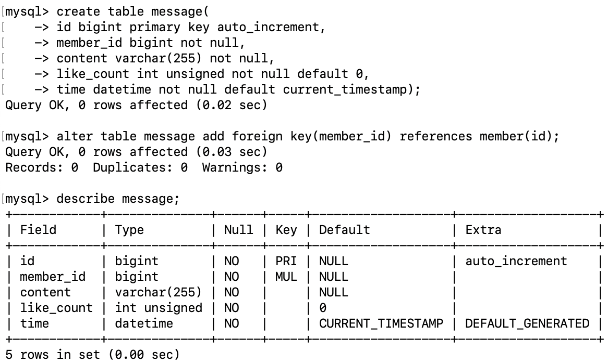

mysql> select [member.name](http://member.name/), message.content from member
-> inner join message on member.id=message.member_id;

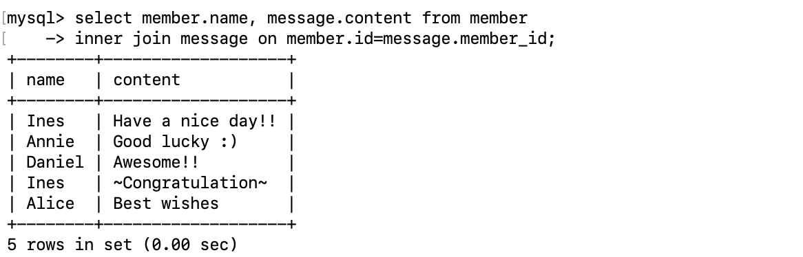

mysql> select [member.name](http://member.name/), message.content from member
-> inner join message on member.id=message.member_id where member.username="test";

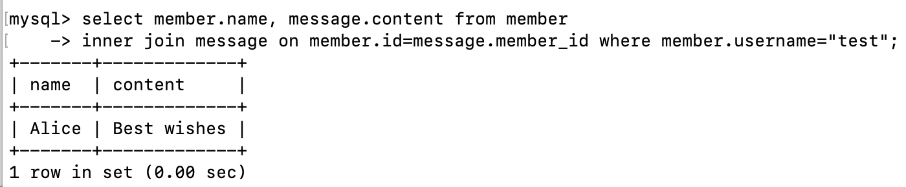

mysql> select member.username, avg(message.like_count) from member
-> inner join message on member.id=message.member_id where member.username="test" group by message.member_id;

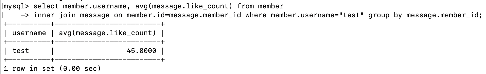
